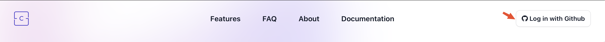

# Install CodeHerald

To sign-up on CodeHerald you need to have a GitHub account and that's it. Press
"Log in with GitHub" button. It is used for both - sign-up and sign-in.

## Choose Account

If it is the first time you are logging-in, GitHub will ask you to choose an
account where to install CodeHerald. You can install CodeHerald to more than one
account by visiting CodeHerald settings later. Meanwhile, this is how the
sign-up flow looks like:

## Choose Repositories

CodeHerald will only be able to listen to events and execute actions on
repositories that you explicitly give permissions to. You can choose to either
allow (1) all repository access, or (2) pick and choose specific repositories
yourself.

## Review Permissions

CodeHerald does not ask for more permissions than it needs to right now. If
permissions will change in the future, GitHub will explicitly ask you to approve
the changes. Meanwhile, CodeHerald needs permissions to add webhooks and execute
actions, issues and pull requests. Checks and security events are needed for
upcoming features, and metadata is a mandatory permission.

## Install & Authorize

That's it for the first time, click "Install & Authorize" and you will be
redirected back to CodeHerald. CodeHerald needs a minute to setup the
repositories, so while that is happening. Start reading the
[quickstart](quickstart.md).

## Next Steps

* Go through the [quickstart](quickstart.md) guide.
